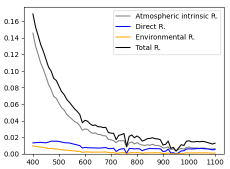
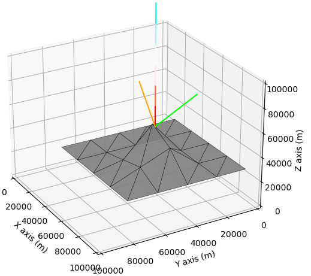

# Instruction - Advanced

This page introduces spectral and 3D radiative-transfer calculations. 


## Be Creative at What You Can Do! 

You can do lots of things with T-Mart! E.g.:

- Load your own DEM and image (they have to be the same size),
- Loop through wavelengths, distances from shore, AOT, viewing or solar angles, etc. 

## Built-in Surface Types 

T-Mart currently provides four built-in spectral surface types: soil, vegetation, water and water with a chlorophyll concentration of 1 µg/L. For example: 


```python
# Create object
water = tmart.SpectralSurface('water_chl1')

# Find spectral reflectance at 400nm
water.wl(400)

# Create a spectral surface in a numpy array 
wl = 400 # your variable in a loop
np.full((2, 2), water.wl(wl))
```

## Case Study: Typical Ocean-Colour Observation 

Here we model a typical hyperspectral ocean-colour observation with the following parameters: 

- View zenith = 30°
- Solar zenith = 30°
- View azimuthal = 90° (to minimize sun-glint)
- Windspeed = 10 m/s
- Atmosphere profile: mid-latitude summer
- Aerosol profile: maritime aerosols 
- AOT550: 0.1 
- Water salinity: 35 parts per thousand
- Water temperature: 20 C
- Water chl-a concentration: 1 µg/L

Water's specular reflectance is calculated following Cox&Munk slope statistics. 

We loop through wavelengths 400 to 1100nm at an interval of 10nm, use a Python list to collect the reflectances at each wavelength, convert it to a Pandas dataframe, and plot the reflectances with the *matplotlib* package:

```python
import tmart
import numpy as np
import pandas as pd
from Py6S.Params.atmosprofile import AtmosProfile

water = tmart.SpectralSurface('water_chl1')

# Master output
pd_output = []

# Specify wavelength in nm
wavelengths = range(400,1110,10)

for wl in wavelengths:

    ### DEM and reflectance ###
    
    # Three same-size numpy arrays are needed
    image_DEM = np.full((2, 2), 0) # in meters
    image_reflectance = np.full((2, 2), water.wl(wl)) # unitless       
    image_isWater = np.full((2, 2), 0) # 1 is water, 0 is land
    
    # pixel width and length, in meters 
    cell_size = 20_000 
    
    # Synthesize a surface object
    my_surface = tmart.Surface(image_DEM,image_reflectance,image_isWater,cell_size)  
    # Set background information, 1 or 2 background surfaces can be set;
    # If 2: the first background is the one closer to [0,0]
    my_surface.set_background(bg_ref        = [water.wl(wl),water.wl(wl)], 
                              bg_isWater    = [1,1], # water
                              bg_elevation  = 0, # elevation of both background
                              bg_coords     = [[0,0],[10,10]]) # a line dividing two background                                    
    
    ### Atmosphere ###
    
    # Atmophere profile comes from 6S
    atm_profile = AtmosProfile.PredefinedType(AtmosProfile.MidlatitudeSummer) 
    aerosol_type = 'Maritime' 
    aot550 = 0.1
    n_layers = 20
    aerosol_scale_height = 2 # Unless you have a reason, don't change this
    
    # Synthesize an atmosphere object    
    my_atm = tmart.Atmosphere(atm_profile, aot550, aerosol_type, n_layers, aerosol_scale_height)   
        
    ### Running T-Mart ###
    
    # Make a T-Mart object 
    my_tmart = tmart.Tmart(Surface = my_surface, Atmosphere= my_atm, shadow=False)
    my_tmart.set_wind(wind_speed=10, wind_azi_avg = True)
    my_tmart.set_water(water_salinity=35, water_temperature=20)
    
    # Specify the sensor's position (x, y, z), viewing direction relative 
    # to the sensor (zenith, azimuth), sun's direction relative to the target 
    # (zenith, azimuth)
    my_tmart.set_geometry(sensor_coords=[51,50,130_000], 
                          target_pt_direction=[150,90],
                          sun_dir=[30,0])
    
    # Run
    n_photon = 10_000
    results = my_tmart.run(wl=wl, n_photon=n_photon)
    
    # Calculate reflectances using recorded photon information 
    R = tmart.calc_ref(results)
    
    for k, v in R.items():
        print(k, '     ' , v)
        
    # Add wavelength and append to output 
    R['Wavelength'] = wl
    pd_output.append(R)

pd_output = pd.DataFrame(pd_output)

# Plot 
import matplotlib.pyplot as plt

plt.plot(pd_output["Wavelength"], pd_output["R_atm"], color='grey', label='Atmospheric intrinsic R.')
plt.plot(pd_output["Wavelength"], pd_output["R_dir"], color='blue', label='Direct R.')
plt.plot(pd_output["Wavelength"], pd_output["R_env"], color='orange', label='Environmental R.')
plt.plot(pd_output["Wavelength"], pd_output["R_total"], color='black', label='Total R.')
plt.ylim(ymin=0)

plt.legend()
plt.show()
```

Output: 



Note that because T-Mart runs wavelength by wavelength and Monte-Carlo solvers are usually slower than other numerical solvers, the code above may take over 10 minutes to run. 

## 3D Surfaces 

To simulate non-flat surfaces, all we need to do is to have non-zero values in the DEM array. Users can import DEMs from rasters through geo-processing packages such as GDAL. 

You can visualize the surface in a single-photon run before calculating the reflective properties of the entire system in a multi-photon run: 


```python
import tmart
import numpy as np
from Py6S.Params.atmosprofile import AtmosProfile

# Specify wavelength in nm
wl = 800

### DEM and reflectance ###

# Three same-size numpy arrays are needed
image_DEM = np.array([[30_000,20_000],[5_000,10_000]]) # in meters
image_reflectance = np.array([[0.5,0.5],[0.5,0.5]])  # unitless     
image_isWater = np.full((2, 2), 0) # 1 is water, 0 is land

# pixel width and length, in meters 
cell_size = 20_000 

# Synthesize a surface object
my_surface = tmart.Surface(DEM = image_DEM,
                           reflectance = image_reflectance,
                           isWater = image_isWater,
                           cell_size = cell_size)  

### Atmosphere ###

# Atmophere profile comes from 6S
atm_profile = AtmosProfile.PredefinedType(AtmosProfile.MidlatitudeSummer) 

# Synthesize an atmosphere object 
my_atm = tmart.Atmosphere(atm_profile)

### Running T-Mart ###

# Make a T-Mart object 
my_tmart = tmart.Tmart(Surface = my_surface, Atmosphere= my_atm)

# Specify the sensor's position (x, y, z), viewing direction relative 
# to the sensor (zenith, azimuth), sun's direction relative to the target 
# (zenith, azimuth)
my_tmart.set_geometry(sensor_coords=[51,50,130_000], 
                      target_pt_direction=[180,0],
                      sun_dir=[0,0])

# Run and plot on a separate window
%matplotlib qt
results = my_tmart.run_plot(wl=wl, plot_on=True, plot_range=[0,100_000,0,100_000,0,100_000])
results = np.vstack(results)

# Calculate reflectances using recorded photon information 
R = tmart.calc_ref(results)
for k, v in R.items():
    print(k, '     ' , v)
```

Output: 




## Adjacency-Effect Modelling 

To be updated. 

## Useful Information 

The following two dataframes completely describe the wavelength-specific atmosphere in T-Mart. 


```python

# Running T-Mart at a specific wavelength will generate 
# an atmosphere at that wavelength in the Tmart object
my_tmart.run(wl=400)

# The atmosphere profile
my_atm_profile = my_tmart.atm_profile_wl

# The aerosol scattering phase function
my_aerosol_SPF = my_tmart.aerosol_SPF_wl
```

The columns of the atmosphere profile:

- Alt_bottom: the bottom the the layer in km.
- Alt_top: the top of the layer in km.
- ot_abs: optical thickness of absroption. 
- ot_rayleigh: optical thickness of molecular or rayleigh scattering. No scattering phase function needed because it is built-in.
- ot_mie: optical thickness of aerosol scattering, relies on the input scattering phase function (see below).
- ot_scatt: sum of ot_rayleigh and ot_mie. 

The columns of the aerosol scattering phase function (currently rely on pre-calculated values, may use miepython in the future to compute on the go):

- Angle: the scattering angle. 
- Value: normalized intensity at the corresponding scattering angle. 

